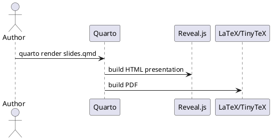

# PlantUML to SVG

The recommended documentation workflow is:

1. Keep diagram source in `.puml` files.
2. Render SVG files.
3. Reference the SVG from `.qmd`.
4. Commit both the source and the SVG.

SVG is preferred because it stays sharp in HTML and PDF outputs.

## Source

Example:



## Render with the Script

macOS/Linux:

```bash
scripts/plantuml-to-svg.sh diagrams/quarto-flow.puml diagrams/quarto-flow.svg
```

Windows PowerShell:

```powershell
.\scripts\plantuml-to-svg.ps1 diagrams\quarto-flow.puml diagrams\quarto-flow.svg
```

## Render Locally

If `plantuml` is installed:

```bash
plantuml -tsvg diagrams/quarto-flow.puml
```

If you downloaded `plantuml.jar`:

```bash
java -jar plantuml.jar -tsvg diagrams/quarto-flow.puml
```

Some diagrams require Graphviz, especially class and component diagrams.

## Render Through Kroki

Kroki provides an HTTP API that accepts diagram text and returns an image. The
helper scripts use this as a fallback when local PlantUML is unavailable.

macOS/Linux:

```bash
curl -fsS \
  -H "Content-Type: text/plain" \
  --data-binary @diagrams/quarto-flow.puml \
  https://kroki.io/plantuml/svg \
  -o diagrams/quarto-flow.svg
```

Windows PowerShell:

```powershell
Invoke-WebRequest `
  -Method Post `
  -Uri "https://kroki.io/plantuml/svg" `
  -ContentType "text/plain" `
  -InFile "diagrams\quarto-flow.puml" `
  -OutFile "diagrams\quarto-flow.svg"
```

## Reference in Quarto

```markdown
{#fig-flow}
```

For PDF rendering, Quarto may need an SVG converter. On macOS, install
`librsvg` if SVG conversion fails:

```bash
brew install librsvg
```
