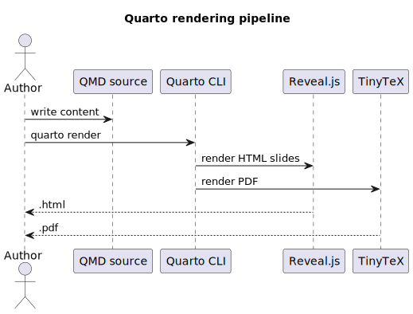

# Foundations

## Standard Content

Use level-2 headings for slides.

- A slide can contain paragraphs, lists, tables, figures, math, and code.
- Level-1 headings create section title slides.
- Use attributes on headings for background colors, images, classes, and footer
  behavior.

## Incremental List

::: {.incremental}
- First point appears.
- Second point follows.
- Third point closes the sequence.
:::

## Columns

:::: {.columns}

::: {.column width="48%"}
### Source

```yaml
format:
  revealjs:
    theme: [default, theme.scss]
```
:::

::: {.column width="48%"}
### Result

- Theme variables apply globally.
- CSS rules handle repeated local styles.
- The deck remains plain-text editable.
:::

::::

## Statement Slide {.statement}

One focused claim per slide is easier to remember than a dense paragraph.

# Visual Slides

## Diagram

{fig-alt="A flow diagram from QMD source through Quarto to HTML slides and PDF."}

## Background Color {.inverse background-color="#102a43"}

Use `background-color` when the slide needs a strong visual break.

```markdown
## Background Color {.inverse background-color="#102a43"}
```

## Background Gradient {.inverse background-gradient="linear-gradient(135deg, #102a43, #2f855a)"}

Gradients work well for title-like slides, transition slides, and summary
slides.

## Background Image {.inverse background-image="../assets/grid-background.svg" background-size="cover" background-opacity="0.72" background-color="#102a43"}

Use a local image when the background should render offline.

## Custom Footer

This slide uses the deck-level footer.

::: footer
Custom per-slide footer: source files, themes, and diagrams stay together.
:::

## No Footer {footer=false}

The heading attribute `footer=false` suppresses the deck footer for this slide.

# Text Patterns

## Quote

> The best Quarto project is boring to render: explicit commands, local assets,
> and source files that explain themselves.

## Aside and Footnote

- Footnotes render at the bottom of the slide.^[This is a slide footnote.]
- Asides are useful for secondary context.

::: aside
Asides should stay short because slide space is limited.
:::

## Callout

::: {.callout-tip}
## Practical habit

Keep generated figures next to their editable source. For PlantUML, commit both
the `.puml` file and the rendered `.svg`.
:::

## Tabset

::: {.panel-tabset}

### macOS

```bash
quarto render slides/slide-styles.qmd
scripts/plantuml-to-svg.sh diagrams/quarto-flow.puml diagrams/quarto-flow.svg
```

### Windows

```powershell
quarto render slides\slide-styles.qmd
.\scripts\plantuml-to-svg.ps1 diagrams\quarto-flow.puml diagrams\quarto-flow.svg
```

:::

# Code and Math

## Code With Highlighted Lines

```{.python code-line-numbers="3-5"}
from pathlib import Path

deck = Path("slides/slide-styles.qmd")
output = Path("_output") / deck.with_suffix(".html").name
print(output)
```

## Shell Commands

```bash
quarto check
quarto render examples/dual-output.qmd --to pdf
quarto render examples/dual-output.qmd --to revealjs
```

## Math

$$
\text{render target} =
\begin{cases}
\text{PDF}, & \text{when } --to=pdf \\
\text{Reveal.js}, & \text{when } --to=revealjs
\end{cases}
$$

# Motion and Notes

## Fragment Blocks

::: {.fragment}
This block appears as a fragment.
:::

::: {.fragment}
This second block appears after the first one.
:::

## Speaker Notes

The audience sees only this slide.

::: {.notes}
Open speaker view with the S key. Put timing reminders, citations, and delivery
notes here rather than on the visible slide.
:::

## Auto-Animate {auto-animate=true}

```text
qmd
```

## Auto-Animate {auto-animate=true}

```text
qmd -> quarto render
```

## Auto-Animate {auto-animate=true}

```text
qmd -> quarto render -> html/pdf
```

# Closing

## Checklist

- Install Quarto.
- Install TinyTeX for PDF.
- Choose or customize a Reveal.js theme.
- Keep diagrams as `.puml` plus `.svg`.
- Render with explicit targets while learning.

## Useful Keys

| Action | Key |
|---|---|
| Next slide | `Space` or right arrow |
| Previous slide | left arrow |
| Full screen | `F` |
| Overview | `O` |
| Speaker view | `S` |
